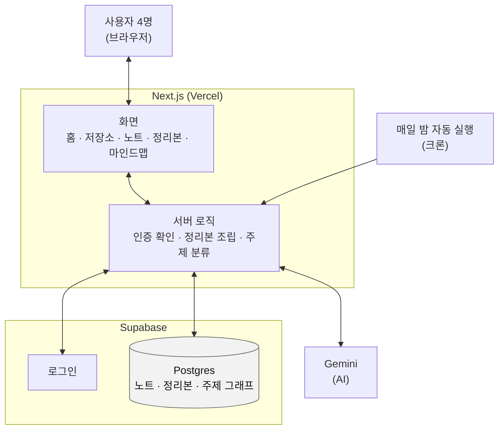
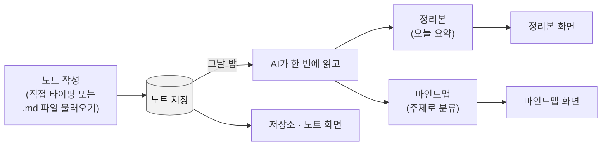

# 팀 스터디 허브 — 시스템 설계도 (간략판)

- 작성일: 2026-08-06
- 자세한 버전: [시스템 설계도](2026-08-06-study-hub-architecture.md) — 인증 시퀀스, 권한표, 파이프라인 상세, 알려진 함정
- 함께 보는 문서: [기획서](2026-08-06-study-hub-brief.md) · [유저 흐름](2026-08-06-study-hub-user-flow.md) · [유저 시나리오](2026-08-06-study-hub-user-scenarios.md)

**한 장으로 끝내는 버전이다.** "이 서비스가 대략 어떻게 생겼는가"만 본다. 왜 이렇게 만들었는지, 함정이 뭔지는 자세한 버전에 있다.

---

## 1. 큰 그림 — 레이어와 데이터 흐름

- **사용자**는 화면만 본다. 저장·인증·AI 호출은 전부 서버 로직 뒤에 숨어 있다.
- **서버 로직**이 유일한 관문이다 — "이 사람이 팀원인가"를 여기서 확인하고, DB는 그 위에 한 번 더(RLS로) 확인한다.
- **AI(Gemini)** 는 매일 밤 자동으로, 또는 사람이 "다시 생성" 버튼을 눌렀을 때만 불려온다. 화면을 열 때마다 부르지 않는다.

## 2. 글 한 편이 가는 길

노트는 딱 한 곳에 저장되고, 화면마다 그걸 다르게 보여줄 뿐이다. **정리본과 마인드맵은 같은 AI 호출 하나에서 함께 나온다** — 둘을 따로 만드는 버튼은 없다.

## 3. 세 줄 요약

1. 4명이 각자 쓰고, 서로 읽는다. 팀·초대·권한 등급 같은 건 없다.
2. 권한은 화면이 아니라 데이터베이스(RLS)가 강제한다.
3. AI는 하루 한 번, 정리본과 주제 분류를 동시에 만든다 — 지어낸 연결·근거는 코드가 걸러낸다.

---

더 깊이 보려면 → [시스템 설계도(자세히)](2026-08-06-study-hub-architecture.md)
