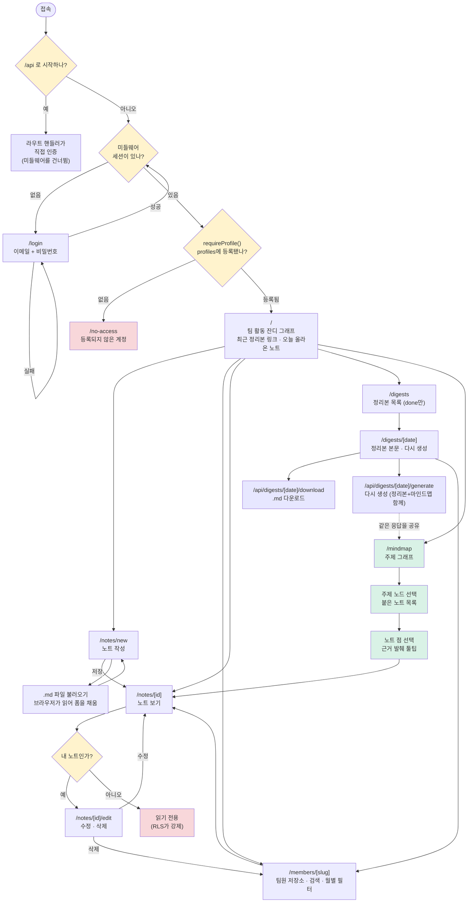
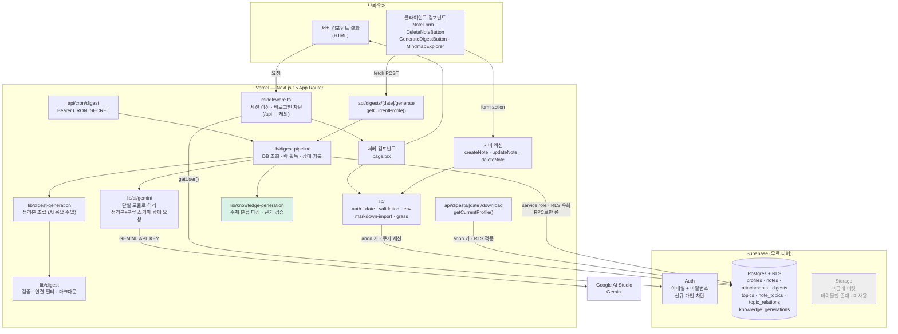
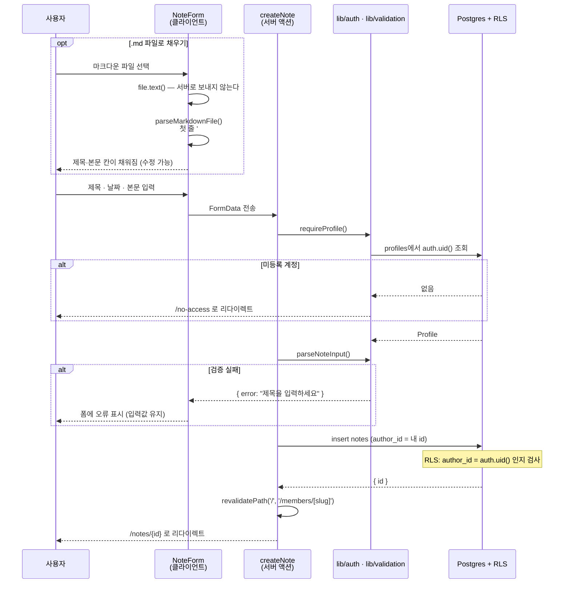
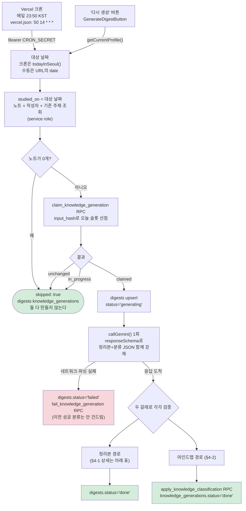
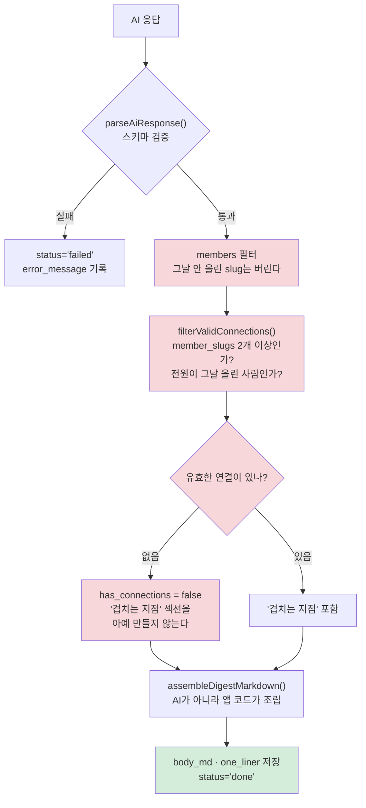
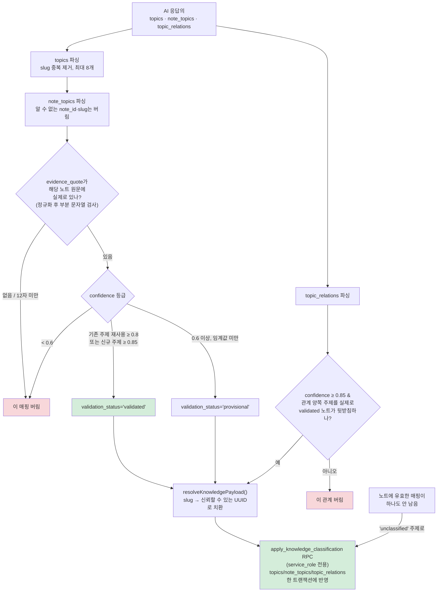
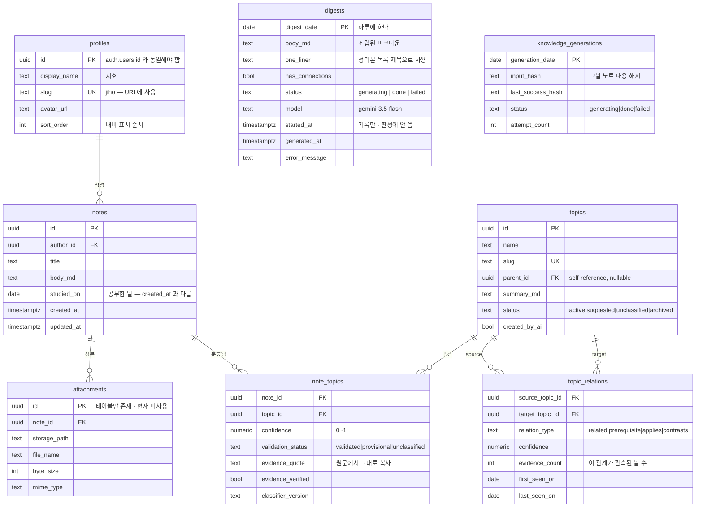
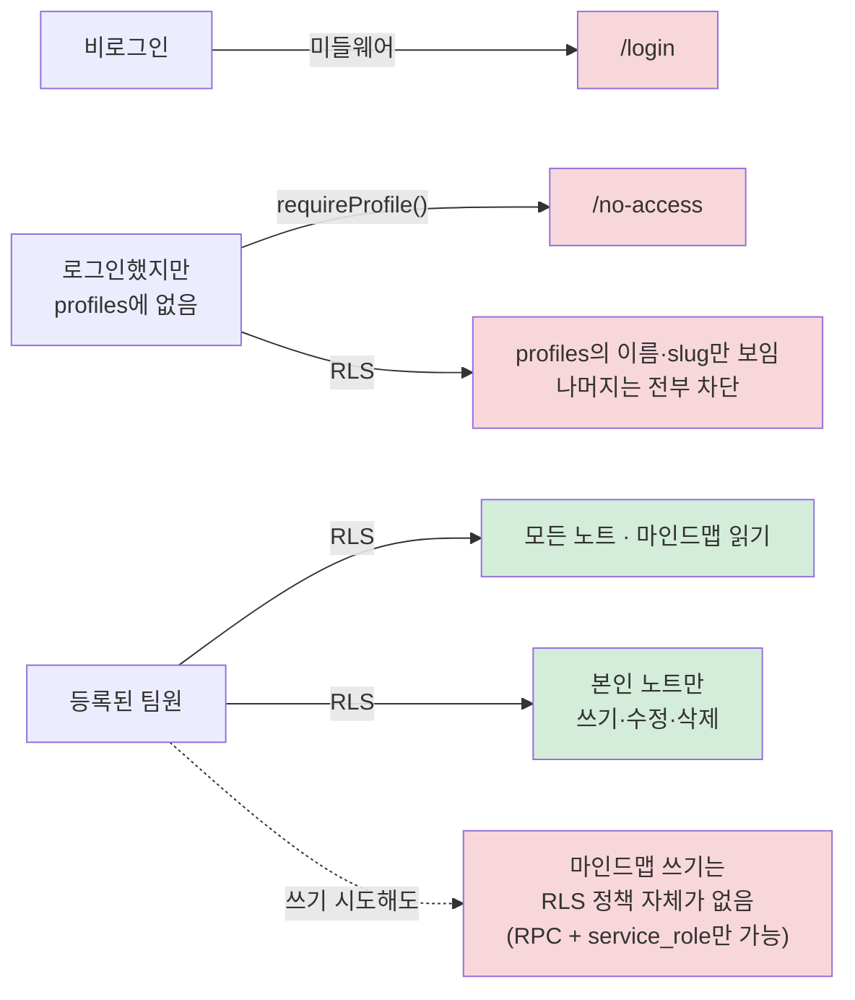

# 팀 스터디 허브 — 시스템 설계도

- 작성일: 2026-08-06
- 함께 보는 문서: [기획서](2026-08-06-study-hub-brief.md) · [유저 흐름](2026-08-06-study-hub-user-flow.md) · [유저 시나리오](2026-08-06-study-hub-user-scenarios.md)
- 화면 이동만 단순하게 보려면 [유저 흐름](2026-08-06-study-hub-user-flow.md)을 먼저 본다. 이 문서는 그 아래 구조를 다룬다.
- SQL 원문·정책 코드는 [설계 문서](2026-08-05-team-study-hub-design.md)와 `supabase/migrations/`에 있다.

> 📌 **여기 그려진 것은 전부 구현돼 동작하는 코드다.** 1~4단계가 모두 끝났다.
> 유일한 예외는 회색으로 표시한 **Storage** — 테이블과 RLS 정책만 있고 쓰는 코드가 없다.
>
> 단계 구분은 [기획서 §7 진행 상황](2026-08-06-study-hub-brief.md)을 따른다. [설계 문서](2026-08-05-team-study-hub-design.md) §13의 단계 구분(2단계 = 첨부파일)은 범위 변경 전 내용이며 이 문서로 대체된다.

---

## 1. 유저 흐름 — 전체

이 서비스에서 가장 중요한 구조는 **인증 게이트가 2겹**이라는 것이다. 미들웨어가 *비로그인*을 막고, `requireProfile()` 이 *로그인은 했지만 팀원이 아닌 계정*을 막는다. 둘은 다른 문제를 푼다.



**게이트가 왜 2겹인가:** 미들웨어는 모든 요청에서 세션을 갱신해야 하므로 어차피 돌아간다. 여기서 비로그인을 쳐내면 페이지 코드가 그걸 신경 쓸 필요가 없다. 하지만 미들웨어는 DB를 조회하지 않는다(모든 요청에서 쿼리를 날릴 순 없다). "이 사람이 우리 팀원인가"는 `profiles` 조회가 필요하므로 페이지 진입 시점에 확인한다.

**`/mindmap`이 별도 생성 버튼이 없는 이유:** 정리본을 만드는 `POST /api/digests/[date]/generate` 가 **같은 AI 응답 안에서** 주제 분류까지 함께 받는다(§4). 그래서 위 그림에서 `REGEN`이 점선으로 `MAP`을 가리킨다 — 사용자가 누르는 버튼은 하나지만 갱신되는 결과물은 둘이다.

### ⚠️ `/api` 는 미들웨어를 통과하지 않는다

미들웨어 `matcher` 에서 `api` 가 제외돼 있다.

```ts
matcher: ['/((?!api|_next/static|_next/image|favicon.ico|...).*)']
```

**크론은 세션 쿠키가 아예 없는 호출자다.** 미들웨어가 먼저 `/login` 으로 리다이렉트해버리면 라우트 핸들러가 `CRON_SECRET` 을 검사할 기회조차 없다.

대신 **모든 `/api` 라우트가 자기 손으로 인증한다.**

| 라우트 | 인증 |
|---|---|
| `POST /api/cron/digest` | `Authorization: Bearer $CRON_SECRET` 일치. 아니면 401 |
| `POST /api/digests/[date]/generate` | `getCurrentProfile()`. 없으면 403 (+ 날짜 형식 검사, 아니면 400) |
| `GET /api/digests/[date]/download` | `getCurrentProfile()`. 없으면 403 |

`requireProfile()` 대신 `getCurrentProfile()` 을 쓰는 이유: 라우트 핸들러는 `(app)` 레이아웃 밖이라 리다이렉트가 아니라 상태 코드로 답해야 한다.

### 화면 목록

전부 구현돼 있다.

| 경로 | 내용 |
|---|---|
| `/` | 팀 활동 잔디 그래프, 최근 정리본 링크, 업로드 버튼, 오늘 올라온 노트 |
| `/members/[slug]` | 팀원 노트 목록(날짜 역순), 제목 검색, 월별 필터, 총 개수 |
| `/notes/new` | 노트 작성 · `.md` 불러오기 |
| `/notes/[id]` | 노트 보기(마크다운 렌더링), 본인 노트면 수정·삭제 |
| `/notes/[id]/edit` | 노트 수정 · `.md` 불러오기 |
| `/digests` | 날짜별 정리본 목록. `status='done'` 만, 그날 참여한 팀원 이름 표시 |
| `/digests/[date]` | 정리본 본문, `.md` 다운로드, 다시 생성 |
| `/mindmap` | **(신규)** 주제 노드 그래프, 노드별 노트, 근거 발췌 툴팁 |
| `/login` | 이메일·비밀번호 로그인 |
| `/no-access` | 로그인은 됐으나 `profiles`에 없는 계정 안내 |

API 라우트 3개: `/api/cron/digest`, `/api/digests/[date]/generate`, `/api/digests/[date]/download` — 마인드맵 전용 API는 없다. 정리본 생성 API가 겸한다.

내비게이션: `홈 · 저장소(팀원 4명) · 정리본 · 마인드맵`

---

## 2. 시스템 구성



**정리본 로직이 여러 겹으로 나뉜 이유가 이 그림의 핵심이다.**

| 모듈 | 하는 일 | DB | AI |
|---|---|---|---|
| `lib/digest.ts` | 스키마 검증, 연결 필터, 마크다운 조립 | ✗ | ✗ |
| `lib/digest-generation.ts` | 이름 매핑, 조립 호출 | ✗ | **응답 주입받음** |
| `lib/knowledge-generation.ts` | 주제·관계 파싱, 근거 문장 원문 대조, slug→UUID 치환 | ✗ | **응답 주입받음** |
| `lib/digest-pipeline.ts` | 노트 조회, 락 획득, AI 호출, 두 결과 각각 저장 | ✓ | **직접 호출** |
| `lib/ai/gemini.ts` | 실제 네트워크 호출 1회 | ✗ | ✓ |

가운데 겹들이 순수하거나 AI 응답을 주입받으므로 **실제 Gemini를 부르지 않고 테스트할 수 있다.** 무료 한도를 소모하지 않고, 응답이 비결정적이라 테스트가 무작위로 실패하는 일도 없다.

**`digest-pipeline`이 AI를 한 번만 부르고 두 모듈에 같은 응답을 나눠준다** — `digest-generation`은 그중 정리본 필드(`one_liner`/`members`/`connections`)만, `knowledge-generation`은 분류 필드(`topics`/`note_topics`/`topic_relations`)만 읽는다.

`download` 라우트만 service role이 아니라 **anon 키 + 쿠키 세션**을 쓴다. 읽기는 RLS가 이미 "등록된 4명"으로 제한하므로 우회할 이유가 없다.

**핵심 원칙 두 가지가 이 그림에 들어 있다.**

1. **권한은 화면이 아니라 Postgres가 강제한다.** 앱 코드는 anon 키 + 쿠키 세션으로만 DB에 접근하므로 RLS를 우회할 수 없다. 버튼을 숨기는 것에 의존하지 않는다.
2. **service role은 RLS를 통째로 우회한다.** 그래서 크론과 생성 API는 핸들러가 **직접** 인증한다. 마인드맵 쓰기 경로(§4)는 한 걸음 더 나가 **RPC 함수 자체의 실행 권한을 `service_role`에만 부여**한다 — `topics`/`note_topics`/`topic_relations`는 일반 RLS insert/update 정책이 아예 없다.

인증 방식은 §1의 표에 있다.

### 환경변수

```
NEXT_PUBLIC_SUPABASE_URL
NEXT_PUBLIC_SUPABASE_ANON_KEY
SUPABASE_SERVICE_ROLE_KEY      # 서버 전용
GEMINI_API_KEY                 # 서버 전용
CRON_SECRET                    # 서버 전용
```

`lib/env.ts` 는 서버 전용 키를 읽기 전에 **실행 환경부터 확인한다.**

```ts
export function getGeminiApiKey(): string {
  if (typeof window !== 'undefined') {
    throw new Error('Gemini API 키는 브라우저에서 접근할 수 없습니다')
  }
  return 필수('GEMINI_API_KEY')
}
```

번들러 설정이나 import 경로 실수로 서버 전용 모듈이 클라이언트 번들에 딸려 들어가면, 조용히 값이 새는 대신 즉시 터진다. `GEMINI_API_KEY` 가 브라우저로 노출되면 제3자가 무료 한도를 소진시킬 수 있다.

---

## 3. 노트 작성 시퀀스



**수정·삭제에는 한 가지 함정이 더 있다.** RLS는 권한 없는 UPDATE/DELETE를 *에러*로 막지 않는다. **영향받은 행 0개**로 조용히 돌려보낸다. 그래서 결과를 확인하지 않고 리다이렉트하면 **실패를 성공처럼 보여주게 된다.**

```ts
const { data } = await supabase.from('notes').update({...}).eq('id', id).select('id')
if (!data || data.length === 0) {
  return { error: '이 노트를 수정할 권한이 없습니다' }   // ← 이 줄이 없으면 조용히 실패한다
}
```

같은 이유로 `deleteNote` 도 삭제된 행 수를 확인한 뒤에만 리다이렉트한다.

**`.md` 불러오기는 서버를 거치지 않는다.** 브라우저가 `file.text()` 로 읽고 `parseMarkdownFile()` 이 제목과 본문을 나눠 폼 칸에 꽂는다. 그 뒤로는 직접 타이핑한 것과 완전히 같은 경로로 저장된다. 업로드 엔드포인트도, 스토리지도, 별도 권한 정책도 필요 없다.

---

## 4. 정리본 + 마인드맵 파이프라인

정리본(§4-1)과 마인드맵 분류(§4-2)는 **같은 트리거, 같은 AI 호출**을 쓰지만 서로 독립적으로 성공·실패할 수 있다. 그래서 상태를 두 테이블에 나눠 기록한다 — `digests`는 정리본 결과만, `knowledge_generations`는 분류 작업의 동시성/재시도 상태만 갖는다.

### 4-1. 전체 흐름



**대상 날짜를 KST로 명시 계산하는 이유:** 크론은 UTC로 돈다. 23:50 KST는 같은 날 14:50 UTC라서 *우연히* 맞아떨어진다. 실행 시각을 15:00 UTC 이후로 옮기는 순간 **조용히 전날 정리본을 만들기 시작한다.**

**스키마 실패 시 재시도하지 않는다.** [설계 문서 §8.2](2026-08-05-team-study-hub-design.md)는 원래 1회 재시도를 계획했지만, 실제로는 폐기됐다 — 재시도 한 번이 정리본과 마인드맵 분류를 **둘 다** 다시 부르는 비용이라 무료 한도에 더 부담이다. 실패는 "다시 생성" 버튼으로 사람이 판단한다.

### 4-1-상세. 정리본 경로



**AI가 지어낸 사람을 두 군데서 거른다.** `connections` 뿐 아니라 `members` 도 그날 실제로 노트를 올린 slug만 남긴다.

```ts
members: 응답.members
  .filter((m) => 이름맵.has(m.profile_slug))   // ← 그날 올린 사람만
```

**AI는 마크다운이 아니라 JSON을 반환한다.** 마크다운 조립은 앱 코드가 한다. 그래야 "겹치는 지점 통째로 제거"가 가능하다 — AI가 완성된 마크다운을 주면 섹션을 안전하게 도려낼 수 없다.

정리본 출력 형식과 다운로드 파일명 규칙은 [설계 문서 §8.3](2026-08-05-team-study-hub-design.md)에 그대로 있다.

### 4-2. 마인드맵 분류 경로 (신규)



**AI-only 결정론적 검증 — 사람 검수 UI가 없다.** `evidenceExistsInNote()`가 `evidence_quote`를 공백·유니코드 정규화 후 노트 본문의 부분 문자열로 실제 대조한다. AI가 요약하거나 어순을 바꾼 "근거"는 통과하지 못하고 조용히 버려진다(에러가 아니다).

**신뢰도 3단계**: `PROVISIONAL_CONFIDENCE`(0.6) 미만은 버림, 기존 주제 재사용은 0.8 이상, AI가 새로 제안한 주제는 0.85 이상이어야 `validated`가 된다. 주제 관계는 0.85 이상이면서 관계 양쪽을 실제로 `validated` 노트가 뒷받침할 때만 저장한다.

**모델이 지어낸 식별자는 DB에 절대 들어가지 않는다.** AI는 `slug` 문자열만 다루고, `resolveKnowledgePayload()`가 RPC를 부르기 전에 신뢰할 수 있는 UUID로 전부 치환한다.

**동시성**: `claim_knowledge_generation(date, input_hash)`가 그날 노트 내용의 해시로 슬롯을 선점한다. 내용이 그대로면 재호출을 건너뛰고(`unchanged`), 20분 넘게 멈춘 `generating`은 새 요청이 이어받는다. 크론과 수동 재생성이 겹치는 경우를 이걸로 막는다.

**실패해도 이전 성공은 보존한다**: AI 호출 자체가 실패하면 `fail_knowledge_generation` RPC가 **이번에 분류되지 못한 노트만** `unclassified` 주제로 보낸다. 이미 검증된 매핑은 건드리지 않는다.

---

## 5. 데이터 모델



`digests`와 `knowledge_generations`는 서로 외래키로 연결되지 않는다. 둘 다 날짜로만 묶이며, 같은 파이프라인이 같은 타이밍에 채운다(§4).

`digests` 본문 안의 팀원 이름은 저장소로 링크되고, `note_topics.evidence_quote`는 화면에서 노트 원문과 대조 표시된다.

인덱스: `notes(author_id, studied_on desc)`, `notes(studied_on)`, `topics(parent_id)`, `note_topics(topic_id, note_id)`, `topic_relations(target_topic_id)`

**`profiles.id` 가 `auth.users.id` 와 같아야 하는 것이 이 스키마의 유일한 수작업 결합점이다.** UID를 잘못 넣으면 "로그인은 되는데 계속 `/no-access` 로 튕기는" 증상이 나오고, 미등록 계정과 화면상 구분되지 않는다.

---

## 6. 권한



| 대상 | 읽기 | 쓰기 | 수정·삭제 |
|---|---|---|---|
| `notes` | 등록된 4명 | 본인 | 본인 |
| `attachments` | 등록된 4명 | 본인 노트 | 본인 노트 (테이블만 존재 · 미사용) |
| `digests` | 등록된 4명 | 서버만 (service role) | 서버만 |
| `topics` / `note_topics` / `topic_relations` / `knowledge_generations` | 등록된 4명 | 서버만 (RPC 실행 권한이 `service_role`에만 부여됨) | 서버만 |
| `profiles` | 로그인한 사용자 ⚠️ | 없음 (대시보드에서 관리) | 없음 |

모든 정책이 "로그인한 사용자"가 아니라 **"`profiles` 에 등록된 사용자"** 를 요구한다.

```sql
-- 읽기: profiles에 등록된 사람만
using ( auth.uid() in (select id from profiles) )

-- 쓰기/수정/삭제: 본인 것만
using ( author_id = auth.uid() )
```

⚠️ **`profiles` 만 예외다.** 읽기 정책에 `auth.uid() in (select id from profiles)` 를 걸면 정책이 자기 자신을 조회해서 **무한 재귀 오류**가 난다. Postgres RLS의 알려진 함정이다. 그래서 `profiles` 읽기만 이렇게 둔다.

```sql
using ( auth.role() = 'authenticated' )
```

미등록 계정이 `profiles` 를 읽으면 팀원 4명의 이름과 slug는 보이지만, 노트·첨부·정리본·마인드맵은 여전히 전부 차단된다. 노출되는 게 이름뿐이라 감수한다.

**마인드맵 테이블은 한 겹 더 막혀 있다.** `topics`/`note_topics`/`topic_relations`에는 애초에 insert/update RLS 정책이 없다 — 쓰기는 오직 `apply_knowledge_classification` 같은 `security definer` RPC를 통해서만 가능하고, 그 RPC의 실행 권한 자체가 `service_role`에만 부여돼 있다(`revoke ... from public, anon, authenticated`). RLS 정책을 잘못 만들 걱정조차 없앤 것이다.

---

## 7. 코드 구조

```
src/lib/date.ts                 KST 날짜 계산
src/lib/env.ts                  환경변수 검증 · 서버 전용 키 가드
src/lib/validation.ts           노트 입력 검증 (순수)
src/lib/markdown-import.ts      .md 제목·본문 분리 (순수)
src/lib/grass.ts                홈 잔디 그래프 활동량 계산 (순수)
src/lib/auth.ts                 현재 사용자 프로필, 접근 게이트
src/lib/digest.ts               정리본 스키마 검증 · 연결 필터 · 마크다운 조립 (순수)
src/lib/digest-generation.ts    정리본 조립 (AI 응답 주입)
src/lib/knowledge-generation.ts 주제 분류 파싱 · 근거 원문 대조 · slug→UUID 치환 (순수)
src/lib/digest-pipeline.ts      노트 조회 · AI 호출 1회 · 두 결과 저장 (service role)
src/lib/ai/gemini.ts            Gemini 호출 — 여기만 네트워크를 탄다
src/lib/supabase/               browser · server · service 클라이언트
src/middleware.ts               세션 갱신, 비로그인 차단 (/api 제외)
src/app/(app)/                  로그인 + 팀원 등록이 필요한 영역 (mindmap 포함)
src/app/api/                    크론 · 정리본 생성 · .md 다운로드
src/components/                 Nav · NoteForm · Markdown · GrassGraph · MindmapExplorer
supabase/migrations/            스키마와 RLS 정책, RPC 함수
vercel.json                     크론 등록 (50 14 * * *)
tests/unit/                     정리본·마인드맵 로직 단위 테스트
tests/rls/                      권한 테스트 — 실제 Supabase에 접속
```

**권한 테스트가 가장 중요한 테스트다.** 권한 결함은 에러를 내지 않고 조용히 존재하므로, 정책을 손댔다면 반드시 RLS 테스트를 다시 돌린다.

**실제 Gemini를 부르는 테스트는 없다.** 무료 한도를 소모하고, 응답이 비결정적이라 테스트가 무작위로 실패한다. `digest-generation`과 `knowledge-generation` 모두 AI 응답을 주입받는 구조라 목으로 전부 검증된다.

```bash
npm test          # 단위 테스트
npm run test:rls  # 권한 테스트 — .env.test.local 필요
```

---

## 8. 알려진 함정

구현 중 시간을 소모할 가능성이 높은 지점이다.

| 함정 | 증상 | 대응 |
|---|---|---|
| RLS 차단은 에러가 아니라 빈 결과 | 저장했는데 목록이 비어 보임 | 접근 거부를 명시 화면으로 표시 (§1) |
| RLS UPDATE/DELETE 차단은 0행 | 실패가 성공처럼 보임 | 영향 행 수를 확인한 뒤 리다이렉트 (§3) |
| RLS 정책이 자기 테이블을 조회 | 무한 재귀 오류 | `profiles` 읽기만 예외 처리 (§6) |
| Vercel 크론은 UTC 기준 | 하루씩 밀린 정리본 | 대상 날짜를 `Asia/Seoul` 로 명시 계산 (§4) |
| Vercel 크론은 배포 환경에서만 동작 | 로컬에서 검증 불가 | 수동 생성 API를 크론보다 먼저 만들었다 |
| service role은 RLS를 우회 | 정리본 API가 무방비 | 핸들러가 직접 인증 (§1) |
| 미들웨어가 `/api` 를 잡으면 | 크론이 `/login` 으로 튕겨 401을 낼 기회조차 없음 | `matcher` 에서 `api` 제외 (§1) |
| AI가 팀원 slug를 지어냄 | 없는 사람의 요약·연결이 실림 | `members`·`connections` 양쪽에서 필터 (§4-1) |
| `evidence_quote`가 요약·재구성된 문장 | 근거가 있어 보이지만 검증에서 조용히 탈락 | 반드시 원문 연속 부분 문자열이어야 함을 프롬프트+코드 양쪽에 명시 (§4-2) |
| 정리본·마인드맵이 AI 호출 하나를 공유 | 한쪽 스키마만 고치면 다른 쪽이 조용히 깨짐 | `lib/ai/gemini.ts`와 `lib/digest.ts`/`lib/knowledge-generation.ts`를 항상 같이 확인 (§2, §4) |
