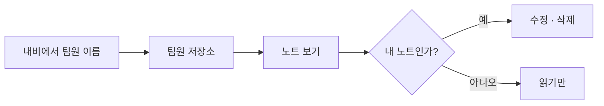
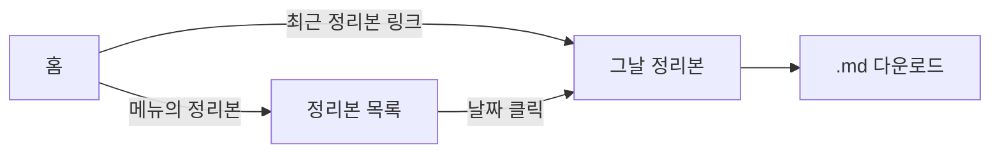
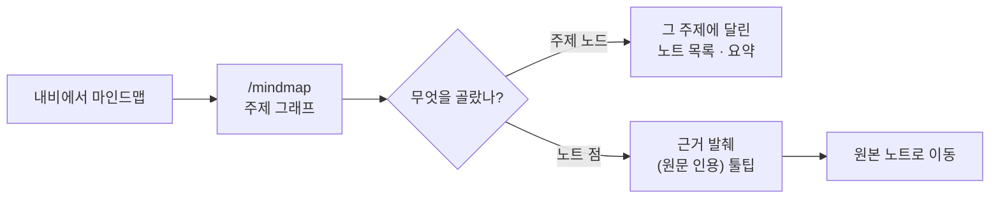
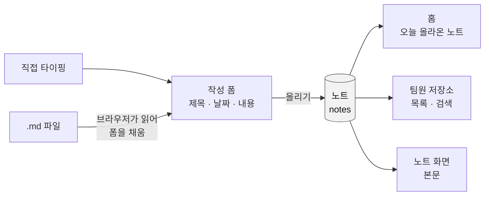
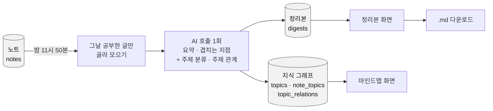

# 팀 스터디 허브 — 유저 흐름

- 작성일: 2026-08-06
- 함께 보는 문서: [기획서](2026-08-06-study-hub-brief.md) · [유저 시나리오](2026-08-06-study-hub-user-scenarios.md) · [시스템 설계도](2026-08-06-study-hub-architecture.md)

**사용자가 무엇을 눌러 어디로 가는가만 그린다.** 예외·실패·권한 처리는 [유저 시나리오](2026-08-06-study-hub-user-scenarios.md)와 [시스템 설계도](2026-08-06-study-hub-architecture.md)에 있다.

§1~4는 **화면**을 따라가고, [§5](#5-데이터는-어디로-가나)는 같은 것을 **글 한 편이 어디로 가는가**로 다시 본다.

---

## 1. 노트 올리기 — 기본 흐름

이게 이 서비스의 전부다. 나머지는 여기서 뻗어 나온다.

홈에서 **오늘 내 스터디 올리기**를 누르면 작성 화면으로 간다. 입력칸은 3개뿐이다 — **제목**, **공부한 날짜**, **내용(마크다운)**. 저장하면 방금 올린 노트 화면으로 넘어간다.

날짜는 오늘로 채워져 있고, 어젯밤 공부한 것이면 직접 바꾼다.

이미 써둔 `.md` 파일이 있으면 맨 위 **마크다운 파일 불러오기**로 제목·내용 칸을 한 번에 채운다. 채워진 뒤엔 손으로 고쳐도 된다.

---

## 2. 남의 노트 읽기

내비게이션은 어느 화면에서나 같다 — `홈 · 저장소(팀원 4명) · 정리본 · 마인드맵`, 하단에 로그아웃.

저장소에는 노트가 최신순으로 쌓인다. 제목으로 검색하거나 월을 골라 걸러 볼 수 있고, 총 개수가 나온다.

노트 화면은 남의 것이든 내 것이든 똑같이 생겼다. 다른 건 맨 아래 버튼뿐이다.

---

## 3. 정리본 보기

전날 밤에 그날 올라온 노트를 AI가 하나로 묶어둔다. 아침에 들어오면 이미 준비돼 있다.

목록에는 완성된 정리본만 뜨고, 날짜 옆에 그날 올린 사람 이름이 붙는다.

정리본에는 **오늘의 한 줄**, **팀원별 요약**, 그리고 실제로 겹친 날에만 **겹치는 지점**이 실린다. 팀원 이름을 누르면 그 사람 저장소로 간다.

오늘 것이 아직 없으면 목록 화면의 **오늘 정리본 만들기**로 만든다. 지난 날짜가 비어 있으면 그 날짜 화면의 **다시 생성**을 누른다. (같은 버튼이 §4의 마인드맵 분류도 함께 새로 만든다 — 하나의 AI 호출을 공유하기 때문이다.)

---

## 4. 마인드맵 보기 (신규)

정리본과 별도 버튼 없이, 정리본을 만든 **같은 AI 호출**이 그날 노트를 주제로 분류하고 주제 사이 관계까지 뽑아둔다. 그래서 사용자 입장에서 "마인드맵을 새로 만드는" 행동은 없다 — 정리본이 갱신될 때 마인드맵도 함께 갱신된다.

주제 노드를 고르면 그 주제로 분류된 노트들이 붙는다. 노트 점에 마우스를 올리면 **AI가 왜 그렇게 분류했는지 원문에서 그대로 뽑은 근거 문장**이 뜬다 — 근거 없이는 분류 자체가 애초에 저장되지 않는다(§4 시스템 설계도 참조). 점을 클릭하면 원본 노트로 이동한다.

---

## 5. 데이터는 어디로 가나

§1~4가 "무엇을 누르는가"였다면, 여기는 같은 것을 **글 한 편이 어디를 거쳐 어디로 가는가**로 본 것이다.

### 5-1. 내가 쓴 글이 지나가는 길

**`.md` 파일은 서버로 가지 않는다.** 브라우저가 읽어서 제목·내용 칸에 넣어줄 뿐이고, 그다음부터는 직접 타이핑한 것과 완전히 같은 길을 간다. 어딘가에 파일로 보관되지 않는다.

글이 저장되는 곳은 **한 군데뿐**이다. 홈도, 저장소도, 노트 화면도 전부 같은 데를 다르게 보여주는 것이다.

### 5-2. 정리본 + 마인드맵이 만들어지는 길

이 길은 밤에 자동으로 한 번 지나간다. **다시 생성** 버튼을 누르면 같은 길을 처음부터 다시 탄다 — 정리본과 마인드맵이 **같은 트리거, 같은 AI 응답**을 나눠 쓰기 때문에 둘 중 하나만 새로고침할 수는 없다.

**묶는 기준은 올린 시각이 아니라 공부한 날짜다.** 작성 폼의 날짜 칸이 그대로 이 기준이 된다. 어젯밤 공부한 것을 오늘 올리면서 날짜를 어제로 바꾸면, 어제 정리본·마인드맵 분류에 들어간다.

정리본과 마인드맵 모두 노트를 **읽기만 한다.** 원본은 손대지 않으므로, 결과가 마음에 안 들면 다시 만들면 그만이다.

그날 올라온 글이 하나도 없으면 정리본도 마인드맵 분류도 아예 만들지 않는다.

---

## 화면 한눈에

| 화면 | 여기서 보이는 것 |
|---|---|
| 로그인 | 이메일 · 비밀번호 · 로그인 버튼 |
| 홈 | 팀 전체 활동 잔디 그래프, 최근 정리본 링크, 올리기 버튼, 오늘 올라온 노트 |
| 스터디 올리기 | 마크다운 파일 불러오기, 제목, 공부한 날짜, 내용, 올리기 버튼 |
| 노트 보기 | 작성자 · 공부한 날짜, 제목, 본문. 내 노트면 맨 아래 수정 · 삭제 |
| 팀원 저장소 | 총 개수, 제목 검색 · 월 필터, 날짜 + 제목 목록(최신순) |
| 정리본 목록 | 오늘 정리본 만들기 버튼, 날짜 + 그날 올린 사람 이름 |
| 정리본 | .md 다운로드 · 다시 생성, 오늘의 한 줄, 팀원별 요약, 겹치는 지점 |
| 마인드맵 (신규) | 주제 노드 그래프, 노드별 노트 목록, 노트 근거 발췌 툴팁 |
